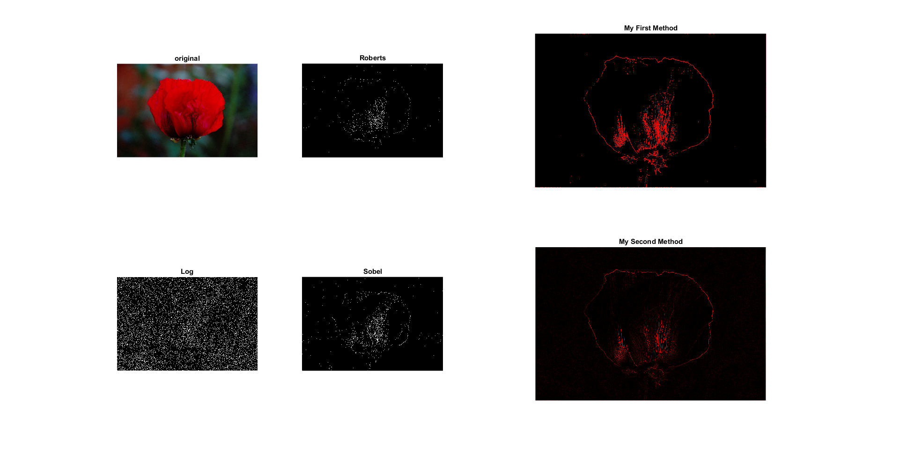

Edge-Detector
========================================
This project mainly aims to detect the edge of `flower.JPG`. But you could also try other images. 
Because the `MethodMyself2` has many loop, it might take a while to show the result.  

please check Result.png or run `Main.m` to see the results. 

Here is the result below:

